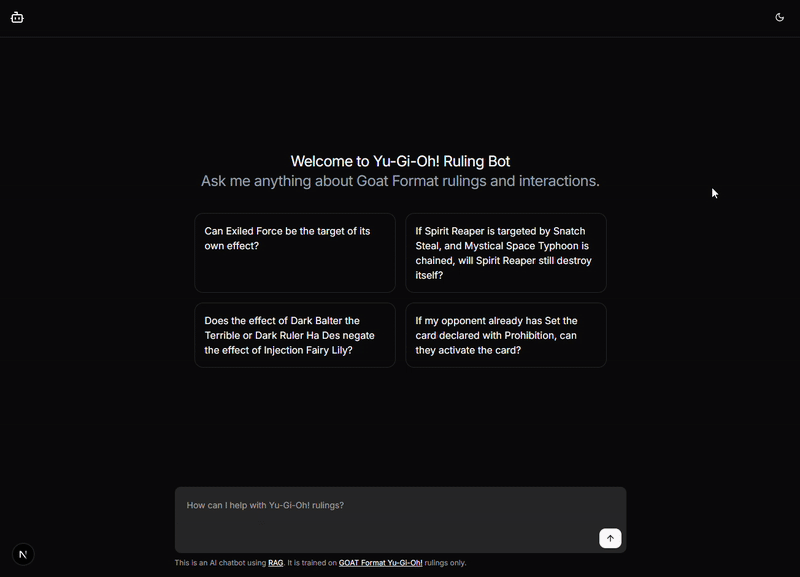

# Yu-Gi-Oh! Ruling AI Chatbot

[](https://nedhmn.github.io/ygo-ruling-ai-chatbot/)
[](./LICENSE)

A monorepo for a Yu-Gi-Oh! ruling AI chatbot focused on [Goat Format](https://www.goatformat.com/whatisgoat.html), built with Turborepo. It leverages AI RAG with OpenAI embeddings and Pinecone for specialized context.

<div align="center" style="margin-bottom: 20px">
    
</div>

## ✨ Key Features

- **Accurate Ruling Responses:** Provides precise answers for Yu-Gi-Oh! Goat Format rulings using a RAG approach.
- **AI-Powered Chatbot:** Combine AI reasoning and relevant context for comprehensive answers.
- **Dockerized Environment:** Ensures easy, consistent setup.
- **Turborepo Monorepo:** Efficiently manages project packages and applications.

## 🛠️ Technologies Used

- **Next.js:** React framework for the chatbot.
- **Vercel AI SDK:** Integrates with AI models.
- **OpenAI:** Used for embeddings and AI models.
- **Pinecone:** Vector database for ruling embeddings.
- **Tailwind CSS:** Utility-first CSS.
- **shadcn/ui:** Reusable UI components.
- **Turborepo:** Monorepo management.
- **ESLint & Prettier:** Code linting and formatting.
- **Cheerio:** Web scraping library for server-side jQuery.
- **Nextra:** Documentation framework.
- **Docker/docker-compose:** Containerization.
- **TypeScript:** For type safety.

## 🚀 Getting Started

This guide will help you get the Yu-Gi-Oh! Ruling AI Chatbot up and running.

### Prerequisites

You will need the following installed:

- **Docker** and **Docker Compose**

Refer to the **[Documentation](https://nedhmn.github.io/ygo-ruling-ai-chatbot/getting-started/installation)** for detailed installation instructions if needed.

### Clone the Repository

```bash
git clone https://github.com/nedhmn/ygo-ruling-ai-chatbot.git
cd ygo-ruling-ai-chatbot
```

### Configure Your Environment

You need to configure environment variables for the `seeder` and `web` services. Example files are provided to help you.

1.  **Create `./packages/seeder/.env.local`:** <br><br>
    Navigate to the `./packages/seeder` directory. Copy the content from `.env.example` in that directory and create a new file named `.env.local`. Fill in the required environment variables for the seeder service).

2.  **Create `./apps/web/.env.local`:**<br><br>
    Navigate to the `./apps/web` directory. Copy the content from `.env.example` in that directory and create a new file named `.env.local`. Fill in the required environment variables for the web service.

Refer to the **[Documentation](https://nedhmn.github.io/ygo-ruling-ai-chatbot/getting-started/configuration)** for a full list and description of all configuration options.

### Run the Application

From the project root, run the following command to build and start the Docker containers:

```bash
docker compose up --build
```

This will start the seeder service (which will populate the database) and then the web application.

> [!NOTE]
>
> The `--build` flag is important the first time you run this command, or after making changes to the Dockerfiles.

Once the `web` service is running, the application should be accessible in your web browser at `http://localhost:3000`.

## 📄 License

This project is licensed under the MIT License - see the [LICENSE](./LICENSE) file for details.
